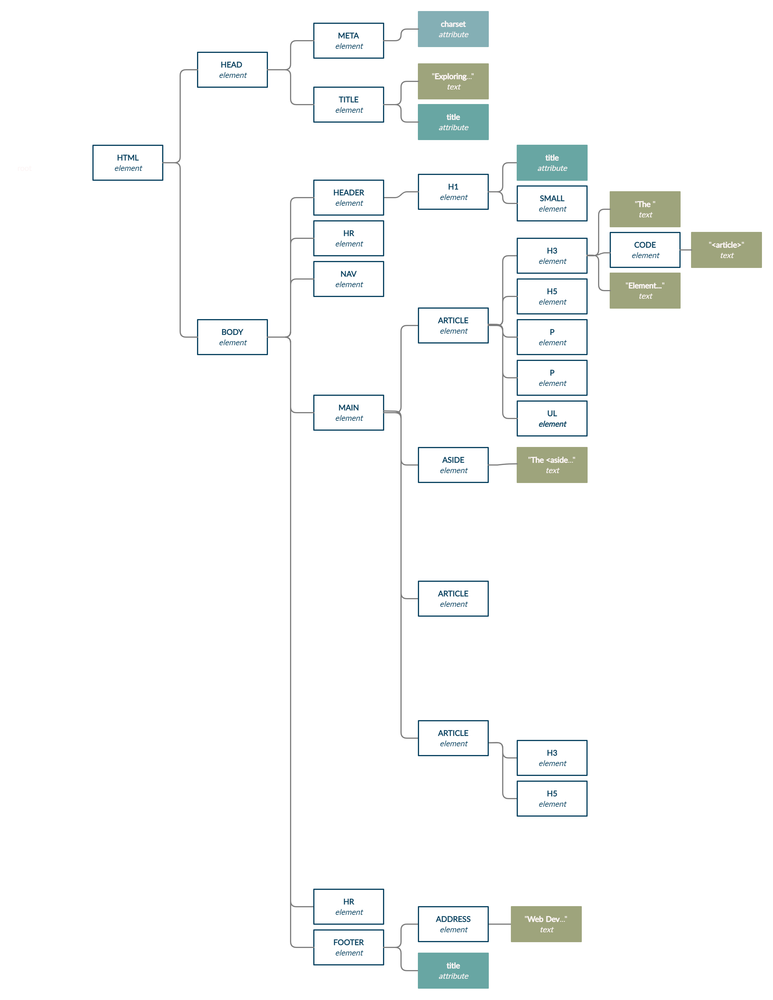

# Class examples for Worksheet 6
#### SYST10049 Web Development

1. Work though Class example 50. 
2. Work through Class example 51. Test and document observations for each potential solution.
3. Test, observe, document, try to recreate yourself; dig deeper and research properties and values used...
   * [example06_001.html](example06_001.html) - explore text properties
   * [example06_002.html](example06_002.html) - explore text properties
   * [example06_021.html](example06_021.html) - explore different selectors
   * [example07_001.html](example07_001.html) - explore background properties
   * [example07_002.html](example07_002.html) - explore color values and units
   * [example07_003.html](example07_003.html) - explore color values and units
   * [example07_010.html](example07_010.html) - explore box model
   * [explore_font.html](explore_font.html) - explore font properties
4. Practice!

---

## Class Example 50
1. Start with the file [exploring_articles.html](exploring_articles.html). Download to your local project "learnCSS".
2. Test and validate.  Correct to remove all errors and warnings.
3. With the validator examine the document outline and structural outline (as demonstrated in class).
4. Make corrections to ensure that outline is correct and consistent.
5. Make a copy of the file. To the new copy only, add the reset link:
 
```html
<link href="https://cdnjs.cloudflare.com/ajax/libs/meyer-reset/2.0/reset.min.css" rel="stylesheet">
</head>
```

6. Compare how the two files render. Analyze and annotate with your obserations.
7. Note: the mark element has not been reset.  Find the default.  How would you reset it?  (ok to leave as is, just ponder!)
8. Copy the original file again.  With this version, create an internal stylesheet (as demonstrated in class).
9. Examine the structure of the document and create its DOM.  This will help with choosing the best *selectors* for your CSS rules.  Like with HTML, keep your code organized, clean, and as short as possible (more code = more processing time = harder code maintenance) 



## Styling your page: Add CSS rules

### STEP 1: Start with well-formed and valid HTML5 code appropriately annotated (comments).
In the head section, add STYLE element with the following:
```html
<style>
/* 
    universal selector is known to be very slow; this time we use it 
    during development to see visually the outline of all elements
    TODO: Remove prior to deployment
*/
* {
    outline: 1px darkred dotted;
}  
</style>
</head>
```
As the comment suggests, all elements are outlined so that we can see the positioning of the content and the effects of browser default properties. THIS IS ONLY TEMPORARY CSS rule during development!

### STEP 2: Consider the general CSS rules first.
Review the [box mode](https://www.w3schools.com/css/css_boxmodel.asp) and related properties. Note the browser defaults. Create CSS3 rules for type selectors and group the selectors that share the same set of declarations.

The property [box-sizing]() is one of many properties that you may need to apply to all, or a majority of the elements on the page. The box-sizing property defines how the width and height of an element are calculated: should they include padding and borders, or not.

```
/*  
    The box-sizing property is used to tell the browser what the sizing properties 
    (width and height) should include. 
    cite: http://www.w3schools.com/cssref/css3_pr_box-sizing.asp
*/
html, body, header, main, footer, nav, ul, li, article, h1, h2, h3, h4, h5, h6, p, aside {
    box-sizing: border-box;
    padding: 0;
    margin: 0;
    display: block; 
}
```

We remove all default padding and margin. The block display allows older browsers to deal with the new HTML5 elements. Note the details:

### STEP 3: Apply the desired values for positioning of the content.
We are leaving colours, fonts, etc. to later. Relative length units scales better between different rendering mediums.

> We will return to this section later.


### STEP 4: Add finishing touches
Remove the temporary outline and apply properties for color, font, text, and the rest of the declarations for put finishing touches to the page.

> Explore these properties 


---

## Class Example 51
- [example51.html](example51.html)

### Description

This example has HEADER with H1 content, followed by four (4) paragraphs of Latin text, and FOOTER content in the body of an HTML5 document.


### Process

1. Start with a valid HTML5 code. (Validate your code at validator.w3.org)
2. Plan what you need to style.
3. Choose what properties and values.
4. Choose the element(s) to apply them to.

#### 1. Create and validate HTML5

#### 2. Plan what to style
 
We want to change the text and background colors, and change the padding, of the first paragraph.
 
#### 3. Choose what properties and values
 
* black background color
* yellow foreground (text) color
* 50 pixels padding at the top and bottom
* 20 pixels padding at the right and left

#### 4. Choose element(s)

We want to select the first paragraph.

### Explore potential solutions

Solution A

```css
<p style="color: yellow; 
          background-color: black; 
          padding: 50px 20px;">
...
</p>
```
inline CSS. Avoid using! hard to change (high specificity) and narrow scope (no code re-usability)
inline (specificity 1000) [6.4.3 Calculating a selector's specificity](https://www.w3.org/TR/2011/REC-CSS2-20110607/cascade.html#q6.0)

---

Solution B

```html
<style>
/* CSS rule */
p {
 background-color: black;
 color: yellow; 
 padding: 50px 20px;
}
</style>
</head>
```
convert to internal styles. Problem: this rule will apply to all paragraphs on the page, not just the first one.
how do you find the right (and best) selector? try, research, try different things [https://www.w3schools.com/css/css_selectors.asp](https://www.w3schools.com/css/css_selectors.asp)
specificity [https://www.w3.org/TR/selectors-3/#specificity](https://www.w3.org/TR/selectors-3/#specificity)

---

Solution C

```css
/* wrong target; first child of body is HEADER */
p:first-child {
 background-color: black;
 color: yellow; 
 padding: 50px 20px;
}
```
---

Solution D

```css
/* wrong target; first child of paragraph is STRONG */
p :first-child {
 background-color: black;
 color: yellow; 
 padding: 50px 20px;
}
```
---

Solution E

```css
/* add an id; not very good; high specificity 100 ; larger DOM */
#one {
 background-color: black;
 color: yellow; 
 padding: 50px 20px;
}
```
---

Solution F

```css
/* over-qualified; there can be only one id="one", increases specificity 101  */
p#one {
 background-color: black;
 color: yellow; 
 padding: 50px 20px;
}
```
---

Solution G

```css
/* better using classes;  specificity 010; larger DOM */
.one {
 background-color: black;
 color: yellow; 
 padding: 50px 20px;
}
```
---

Solution H

```css
/* after adding div parent to paragraphs ; specificity 011 */
p:first-child {
 background-color: black;
 color: yellow; 
 padding: 50px 20px;
}
```
---

Solution I

```css
/* good choice; no additional elements required; low specificity 011 */
p:nth-child(2) {
 background-color: black;
 color: yellow; 
 padding: 50px 20px;
}
```
---

Solution J

```css
/* best choice; the most descriptive; low specificity 011 */
p:first-of-type {
 background-color: black;
 color: yellow; 
 padding: 50px 20px;
}
```
---

Solution ?

 any other or better choices? 


---

> Web Development @ Sheridan College

