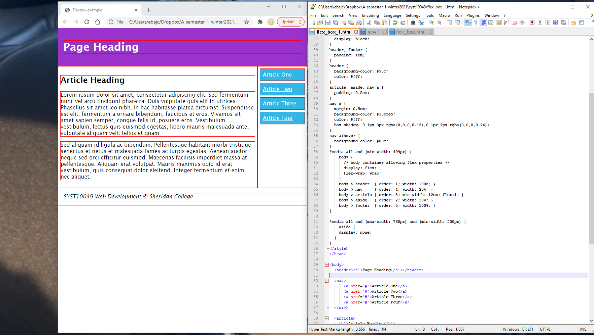

# Flexbox example explained

Flexbox components used in this example: * `display: flex` declaration, `flex-wrap` property, `order` property, `flex` property

### CSS3 Flexbox [explore deeper at w3schools](https://www.w3schools.com/css/css3_flexbox.asp)
* design flexible responsive layout structure without using float or positioning

Flex container (parent element)
* `align-content`	Modifies the behavior of the flex-wrap property. It is similar to align-items, but instead of aligning flex items, it aligns flex lines|
* `align-items`	Vertically aligns the flex items when the items do not use all available space on the cross-axis
* `display`	Specifies the type of box used for an HTML element
* `flex-direction`	Specifies the direction of the flexible items inside a flex container
* `flex-flow`	A shorthand property for flex-direction and flex-wrap
* `flex-wrap`	Specifies whether the flex items should wrap or not, if there is not enough room for them on one flex line
* `justify-content`	Horizontally aligns the flex items when the items do not use all available space on the main-axis* 

Flex item: (child element) &mdahs; direct child elements of a flex container automatically becomes flexible (flex) items.
* `align-self`	Specifies the alignment for a flex item (overrides the flex container's align-items property)
* `flex`	A shorthand property for the flex-grow, flex-shrink, and the flex-basis properties
* `flex-basis`	Specifies the initial length of a flex item
* `flex-grow`	Specifies how much a flex item will grow relative to the rest of the flex items inside the same container
* `flex-shrink`	Specifies how much a flex item will shrink relative to the rest of the flex items inside the same container
* `order`	Specifies the order of the flex items inside the same container

### Start with valid HTML5 document.  This is a standard content layout, with header, footer, navigation, article and aside.

```html
<body>
  <header><h1>Page Heading</h1></header>  
  <nav>
      <a href="#">Article One</a>
      <a href="#">Article Two</a>
      <a href="#">Article Three</a>
      <a href="#">Article Four</a>
  </nav>  
  <article>
    <h1>Article Heading</h1>
    <p>Lorem ipsum dolor sit amet, ... clus et quam.</p>
    <p>Sed aliquam id ligula ac ...nec aliquet.</p>
  </article>  
  <aside>
    <h5>Aside Heading</h5>
    <p>Vivamus in ex neque. Maecenas ... pulvinar in sed elit.</p>
  </aside>	
  <footer><address>SYST10049 Web Development © Sheridan College</address></footer>
</body>
```
Figure 82. 


### Styling

* change the value of box-sizing and set outline for all elements.  (at the end remove the outline declaration)

Figure 83. 


* set font-family to "Lucida Sans",sans-serif for HTML selector
* set padding to 0, margin to 0, and display to block for BODY, HEADER, FOOTER, NAV, ARTICLE, ASIDE, and A
* set padding to 1em for HEADER and FOOTER (this is redefinition)
* set the background color to #93c and foreground color to #fff for HEADER (note that we are trying to reduce the number of declarations)
* set padding to 0.5em for ARTICLE, ASIDE, and A when descendant of NAV

Figure 84. 


* set margin to 0.5 em, background color to #33b5e5, text color #fff, and box shadow for A when descendant of NAV

```css
/* note that there are two shadows declared, separated by a comma */
box-shadow: 0 1px 3px rgba(0,0,0,0.12), 0 1px 2px rgba(0,0,0,0.24)
```

* set background color to #09c for A when descendant of NAV, when the hover event occurs

Figure 85. 

## Flexbox

* BODY is the parent container of HEADER, FOOTER, NAV, ARTICLE, and ASIDE. Add the rule

```css
body { 
  /* body container allowing flex properties */
  display: flex;  
  /* The wrap value specifies that the flex items will wrap */
  flex-wrap: wrap;
}
```

Figure 86. 

* you can easily change change the order of the elements; for example, if you want the navigation on the right and aside on the left:

```css
body > header  { order: 1; width: 100%; }
body > nav     { order: 4; width: 20%; }
body > article { order: 3; min-width: 12em; flex:1; }
body > aside   { order: 2; width: 30%; }
body > footer  { order: 5; width: 100%; }
```
Figure 89. 

* you can hide the aside when the screen is not wide enough

```css
@media all and (max-width: 760px) and (min-width: 500px) {
    aside {
    display: none;
  }
}
```
Figure 90. 

## Media Query
* All rules nested inside the media query will be applied when all conditions are met, in this case, it can be any media ( ) and the width of the screen is at least 799 pixels


```css
@media all and (min-width: 799px) {
}
```

Figure 87. 

* When the above conditions are not met (showing width of screen less than 799 pixels), the flexbox declarations are not applied.


Figure 88. 

---
> SYST10049 Web Development @ Sheridan College


