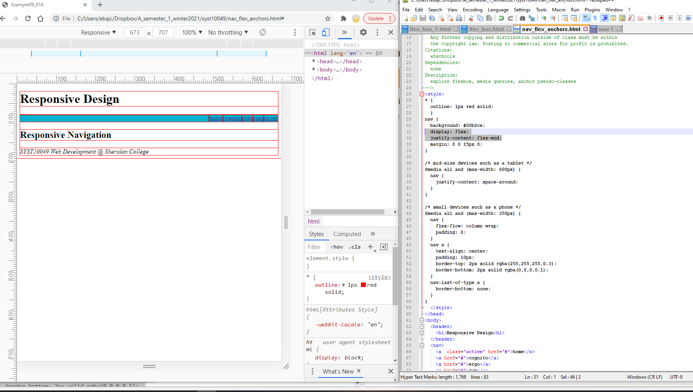

# Flexbox example explained

Flexbox components used in this example: * `display: flex` declaration, `flex-wrap` property, `order` property, `flex` property

### CSS3 Flexbox [explore deeper at w3schools](https://www.w3schools.com/css/css3_flexbox.asp)
* design flexible responsive layout structure without using float or positioning

Flex container (parent element)
* `align-content`	Modifies the behavior of the flex-wrap property. It is similar to align-items, but instead of aligning flex items, it aligns flex lines|
* `align-items`	Vertically aligns the flex items when the items do not use all available space on the cross-axis
* `display`	Specifies the type of box used for an HTML element
* `flex-direction`	Specifies the direction of the flexible items inside a flex container
* `flex-flow`	A shorthand property for flex-direction and flex-wrap
* `flex-wrap`	Specifies whether the flex items should wrap or not, if there is not enough room for them on one flex line
* `justify-content`	Horizontally aligns the flex items when the items do not use all available space on the main-axis* 

Flex item: (child element) &mdahs; direct child elements of a flex container automatically becomes flexible (flex) items.
* `align-self`	Specifies the alignment for a flex item (overrides the flex container's align-items property)
* `flex`	A shorthand property for the flex-grow, flex-shrink, and the flex-basis properties
* `flex-basis`	Specifies the initial length of a flex item
* `flex-grow`	Specifies how much a flex item will grow relative to the rest of the flex items inside the same container
* `flex-shrink`	Specifies how much a flex item will shrink relative to the rest of the flex items inside the same container
* `order`	Specifies the order of the flex items inside the same container

### Start with valid HTML5 document.  This is a standard content layout, with header, footer, navigation, article and aside.
In this example,  BODY will be defined as the flex container; direct children then are HEADER, NAV, ARTICLE, ASIDE, and FOOTER.

Figure72. 

---
> SYST10049 Web Development @ Sheridan College
